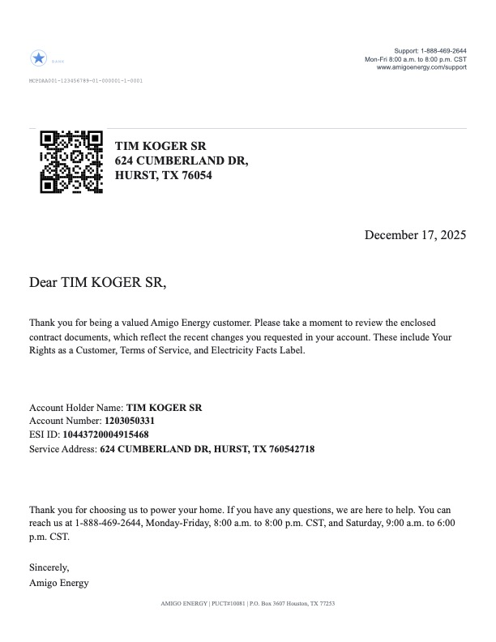
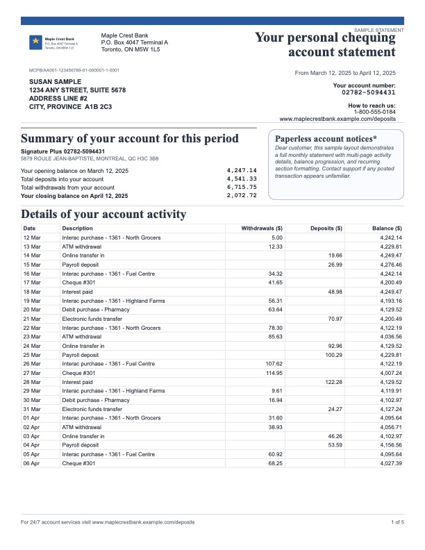

# SmartDocs (Alpha)

Open-source, AI-ready document generation engine for enterprise communications.

[](https://github.com/snehalsurti12/smartdocs)
[](./LICENSE)
[](https://github.com/snehalsurti12/smartdocs/actions/workflows/ci.yml)
[](https://nodejs.org/)

SmartDocs gives you a visual template editor, deterministic data binding, and print-ready PDF rendering, self-hosted and MIT licensed, with a clear roadmap for agentic AI workflows.

## The Problem

Most enterprise document platforms are expensive, closed, and hard to adapt. Teams still spend too much time on template setup, mapping, and pagination quirks across systems like Salesforce and other CRMs.

## What SmartDocs Does Differently

- **Visual template editor**: true drag/drop authoring with text, tables, images, QR, lines, and layout tools.
- **Deterministic rendering**: multi-page flow text, auto-paginated tables, repeatable header/footer logic, and print-ready PDF output.
- **Structured data contracts**: explicit bindings, validation, and predictable payload-driven generation.
- **Open and self-hostable**: MIT licensed, local-first workflow, and clear path to private deployment.
- **Agent-ready direction**: roadmap includes MCP tools, mapping intelligence, and AI-assisted workflow automation.

## Who This Is For

- Salesforce and CRM teams building customer communications at scale
- Enterprises replacing high-cost closed-source doc generation stacks
- Regulated domains needing repeatable output and auditable template changes
- Engineering teams that want programmable document pipelines

## Screenshots

Enterprise cover + terms + EFL sample:



Bank statement sample:



## Status

`Alpha` (`0.x`): suitable for evaluation and POCs, not yet production-hardened.

## 5-Minute Quickstart

```bash
npm install
npm run editor
```

Open `http://localhost:5177`.

Try a production-like starter:

1. Click `Load Starter`
2. Choose `Enterprise Program Update (2-Page)` or `Enterprise Cover Package`
3. Follow the workflow strip: `Design -> Data -> Test -> Publish`
4. Click `Preview PDF`

## Capabilities

### Available today

- Visual editor (`editor/`) with:
  - guided workflow strip (`Design`, `Data`, `Test`, `Publish`) and top primary actions (`New`, `Check`, `Save`, `Preview PDF`)
  - text, flow text, image, table, line, box, qr components
  - true palette drag/drop with placement preview
  - drag/move/resize on canvas
  - multi-select (`Shift+Click`) + delete multi-selection
  - snap guides, align, and distribute tools
  - inline editing for text
  - manual page authoring (`Add Page`/`Delete Page`)
  - per-element property panel
  - data preview toggle + page navigation
- Rendering engine (`scripts/render.js`) with:
  - template + data merge
  - data contract mapping/transforms
  - multi-page flow text and table pagination
  - repeat modes: `first`, `afterFirst`, `middle`, `last`, `all`
  - explicit per-element page targeting
- PDF generation (`scripts/render-pdf.js`) via Playwright
- JSON schema validation (`schemas/template.schema.json`)
- Golden PDF regression checks (`scripts/golden-pdf.js`)
- Starter templates:
  - invoice
  - credit-card statement
  - bank statement
  - image + text showcase (icons + colored sections)
  - enterprise communication pack (cover + terms + EFL)

### In progress / next

- stronger governance (`dev` -> `uat` -> `prod` promotion)
- approval workflow and richer change history
- public API auth + tenant controls
- Salesforce mapping layer
- agentic/MCP tool surface for automated document workflows

See `docs/ROADMAP.md` for milestones.

## Capability Matrix

| Area | Current | Planned |
|---|---|---|
| Template editing | Rich visual editor, inline editing, drag/resize, align/distribute | Group/lock layers, advanced table tooling, richer rich text |
| Pagination | Multi-page flow text + auto table pagination + repeat modes | Better keep-together controls and finer pagination constraints |
| Data contracts | Binding extraction, contract checks, transform skeleton | Visual mapping UX, stronger validation diagnostics |
| Regression safety | Schema checks + golden PDF tests | Broader visual diff coverage and stricter CI gating |
| Lifecycle governance | Versioning skeleton + audit model | Approvals, environment promotion, release controls |
| Integrations | Local APIs, Postgres persistence skeleton | Authenticated public APIs, Salesforce integration, MCP server |

## CLI Usage

Validate a template:

```bash
npm run validate -- --template examples/template.json
```

Render HTML:

```bash
npm run render -- --template examples/template.json --data examples/data.json --out out/render.html
```

Render PDF:

```bash
npm run render:pdf -- --template examples/template.json --data examples/data.json --out out/render.pdf
```

If Playwright browser binaries are missing:

```bash
npx playwright install chromium
```

Run baseline checks:

```bash
npm run check
```

Run PDF golden regression gate locally:

```bash
npx playwright install chromium
npm run golden:pdf
```

Refresh golden snapshots after intentional layout changes:

```bash
npm run golden:pdf:update
```

## Postgres Persistence (Prisma Skeleton)

SmartDocs includes a DB persistence skeleton for template lifecycle:

- `Template`
- `TemplateVersion` (immutable versions)
- `AuditEvent` (append-only history)

Setup:

```bash
cp .env.example .env
npm install
npm run db:up
npm run prisma:migrate -- --name init_templates
npm run prisma:generate
```

Stop local Postgres container:

```bash
npm run db:down
```

Optional smoke test:

```bash
npm run db:smoke
```

If you prefer a non-Docker DB, point `DATABASE_URL` to any compatible Postgres instance and run the same Prisma commands.

When `DATABASE_URL` is set, the editor server exposes template APIs:

- `GET /api/templates`
- `POST /api/templates`
- `GET /api/templates/:id`
- `PATCH /api/templates/:id`
- `GET /api/templates/:id/versions`
- `POST /api/templates/:id/versions`
- `GET /api/templates/:id/audit`

## Repository Layout

- `editor/` UI and interaction logic
- `scripts/` renderer, PDF pipeline, validation, dev server
- `prisma/` Postgres schema for template persistence
- `schemas/` template JSON schema
- `examples/` sample templates + sample data
- `docs/` model/spec/roadmap docs
- `tests/` golden PDF and regression coverage

## Additional Docs

- Open-source launch checklist: `docs/OPEN_SOURCE_LAUNCH.md`
- Launch post drafts: `docs/LAUNCH_POSTS.md`
- Persistence model details: `docs/persistence-model.md`

## Contributing

See `CONTRIBUTING.md`.

High-value contribution areas:

- pagination parity and page-break controls
- richer table authoring controls
- governance workflow primitives (approval/promotion)
- API + integration hardening

## Community

- Feature ideas: https://github.com/snehalsurti12/smartdocs/discussions/categories/ideas
- Q&A: https://github.com/snehalsurti12/smartdocs/discussions/categories/q-a
- Bug/feature issues: https://github.com/snehalsurti12/smartdocs/issues

## Security

See `SECURITY.md`.

## License

MIT (`LICENSE`).
