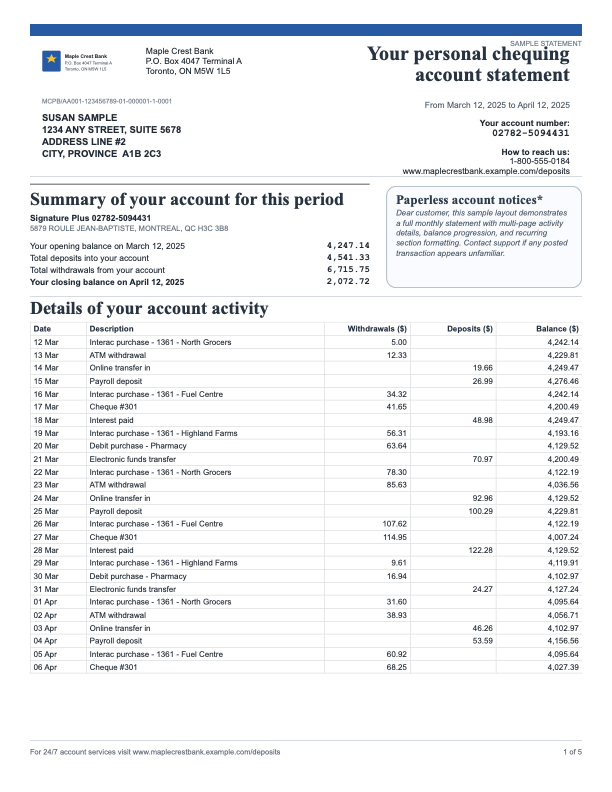

# SmartDocs (Alpha)

Template-driven document designer and renderer for enterprise-style communications.

[](https://github.com/snehalsurti12/smartdocs)
[](./LICENSE)
[](https://github.com/snehalsurti12/smartdocs/actions/workflows/ci.yml)
[](https://nodejs.org/)

`SmartDocs` lets you:
- design templates with drag/drop components
- bind template fields to structured JSON payloads
- generate print-ready HTML and PDF
- build multi-page packs with repeated header/footer logic
- validate templates against a strict schema

## Screenshots

Enterprise cover + terms + EFL sample:


Bank statement sample:



## Status

`Alpha` (0.x): suitable for evaluation and POCs, not yet production-hardened.

## What Exists Today

- Visual editor (`editor/`) with:
  - text, flow text, image, table, line, box, qr components
  - drag/move/resize
  - inline editing for text
  - per-element property panel
  - data preview toggle + page navigation
- Rendering engine (`scripts/render.js`) with:
  - template + data merge
  - data contract mapping/transforms
  - multi-page flow text and table pagination
  - repeat modes: `first`, `afterFirst`, `middle`, `last`, `all`
- PDF generation (`scripts/render-pdf.js`) via Playwright
- JSON schema validation (`schemas/template.schema.json`)
- Starter templates:
  - invoice
  - credit-card statement
  - bank statement
  - terms + cover package (enterprise sample)

## Quickstart

```bash
npm install
npm run editor
```

Open `http://localhost:5177`.

Try a production-like starter:

1. Click `Load Starter`
2. Choose `Enterprise Cover Package`
3. Click `Preview PDF`

## CLI Usage

Validate a template:

```bash
npm run validate -- --template examples/template.json
```

Render HTML:

```bash
npm run render -- --template examples/template.json --data examples/data.json --out out/render.html
```

Render PDF:

```bash
npm run render:pdf -- --template examples/template.json --data examples/data.json --out out/render.pdf
```

If Playwright browser binaries are missing:

```bash
npx playwright install chromium
```

Run baseline checks:

```bash
npm run check
```

## Postgres Persistence (Prisma Skeleton)

SmartDocs now includes a DB persistence skeleton for template lifecycle:
- `Template`
- `TemplateVersion` (immutable versions)
- `AuditEvent` (append-only history)

Setup:

```bash
cp .env.example .env
npm install
npm run db:up
npm run prisma:migrate -- --name init_templates
npm run prisma:generate
```

Stop local Postgres container:

```bash
npm run db:down
```

Optional smoke test:

```bash
npm run db:smoke
```

If you prefer a non-Docker DB, point `DATABASE_URL` to any compatible Postgres instance and run the same Prisma commands.

When `DATABASE_URL` is set, the editor server exposes template APIs:
- `GET /api/templates`
- `POST /api/templates`
- `GET /api/templates/:id`
- `PATCH /api/templates/:id`
- `GET /api/templates/:id/versions`
- `POST /api/templates/:id/versions`
- `GET /api/templates/:id/audit`

## Repository Layout

- `editor/` UI and interaction logic
- `scripts/` renderer, PDF pipeline, validation, dev server
- `prisma/` Postgres schema for template persistence
- `schemas/` template JSON schema
- `examples/` sample templates + sample data
- `docs/` model/spec/roadmap docs

## Known Gaps (Planned)

- Template versioning and environment promotion
- Approval workflows and audit trail
- Role-based access control
- API auth, tenancy, and rate limiting
- More robust regression test suite and golden-file visual diffs

See `docs/ROADMAP.md` for planned milestones.
Launch checklist is in `docs/OPEN_SOURCE_LAUNCH.md`.
Launch post templates are in `docs/LAUNCH_POSTS.md`.
Persistence model details are in `docs/persistence-model.md`.

## Contributing

See `CONTRIBUTING.md`.

## Community

- Share feature ideas in Discussions: `Ideas`
- Ask usage questions in Discussions: `Q&A`
- Open Issues for implementation-ready bugs/features

## Security

See `SECURITY.md`.

## License

MIT (`LICENSE`).
